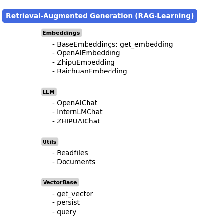
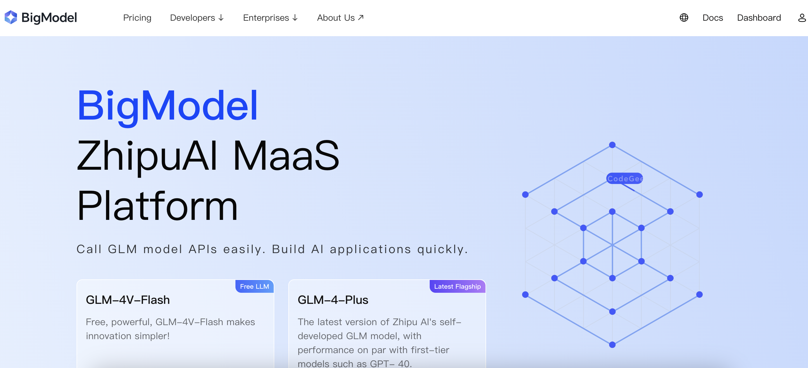
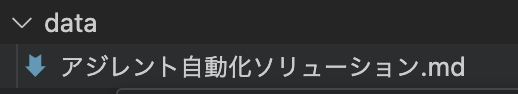

# RAG技術を利用してローカルマニュアルのQAシステムを構築する


## Summary

<div style="max-width: 600px; word-wrap: break-word;">

本プロジェクトでは、ZhipuAI が提供する ChatGLM モデル（無料でAPIを使用可能です） を使用して、ローカルの取扱説明書を基にしたQAシステムを構築しました。このシステムは、ユーザーが説明書に基づいて質問を入力すると、RAG技術を活用して関連情報を検索し、適切な回答を生成します。

例えば、以下のような質問と回答が生成されます：

**質問1**: マイクロプレート用スタッカーシステムのプレート搬送時間は何ですか  
**回答1**: マイクロプレート用スタッカーシステムのプレート搬送時間はおよそ8秒です。これは「コンパクト設計プレート搬送時間およそ8秒の高速ロボット2、4、6本スタッカーの3タイプモデル」と記載されています。

**質問2**: ロボット対応サーマルシール方式マイクロプレートシーラーは一枚プレートは何秒をかかりますか  
**回答2**: 1枚あたり8秒の高速シーリングを行います。

**質問3**: マルチチャンネル自動分注機（96 / 384ヘッド）の精度は何ですか  
**回答3**: マルチチャンネル自動分注機（96 / 384ヘッド）の精度は、0.3–250µLの範囲でCVが5%以下の高精度分注が可能です。

</div>


## 1. RAGについて

<div style="max-width: 600px; word-wrap: break-word;">

RAG（Retrieval-Augmented Generation、検索拡張生成）は、検索エンジンや情報検索技術を統合した生成型AIの一種です。大規模言語モデル（LLM）と外部知識ベースを組み合わせて、質問に対するより正確で最新の回答を生成する仕組みを提供します。以下に、RAGの基本的な概念を説明します：

</div>


### 1.1 RAGの仕組み

<div style="max-width: 600px; word-wrap: break-word;">

RAGは主に以下の3つのステップで構成されます：
1. Retrieve（検索）:
   ユーザーの質問（Query）を基に、知識ベースや外部データベース（例：ドキュメント、Webデータなど）から関連情報を検索します。例えば、ベクトルデータベースを使用して質問に関連する情報を高速で取得します。

2. Augment（補完・拡張）:
	• 検索結果をもとにコンテキスト情報を生成します。
	• 検索したデータをプロンプトとして言語モデルに渡すことで、回答生成に必要な情報を補完します。

3. Generate（生成）:
	• 言語モデル（例：GPT、BERTなど）が検索データを利用して最終的な回答を生成します。
	• 外部データベースから得た情報を活用することで、モデルが学習していない新しい情報を含めた回答が可能になります。

</div>

### 1.2 RAGの流れ

<div align="left">
    
</div>
Image from https://blog-ja.allganize.ai/allganize_rag-1/


### 1.3 この実践例のRAG構造




## 2. Prepare

### 2.1 必要なパッケージをインストールする Python 3.10 以上に必要です。

```bash
pip install -r requirements.txt
```

###  2.2 ZHIPUAI API申請

<div style="max-width: 600px; word-wrap: break-word;">

ZHUPUAIのAPIを利用するには、公式サイトでアカウントを登録し、APIキーを取得する必要があります。新規登録後、無料のトークンが提供され、実名認証を完了すると追加のトークンが付与されます。
APIのコードを発行しましたら、.envドキュメントの中に　ZHIPUAI_API_KEY='your API key'、your API keyの置換します。

<div align="left">
    
</div>

</div>

###  2.3 自分のデータを準備して、data/ディレクトリに配置してください。

<div align="left">
    
</div>


## 3 実行

### 3.1 必要なパッケージをimport

```python
from RAG.VectorBase import VectorStore
from RAG.utils import ReadFiles
from RAG.LLM import OpenAIChat
```

### 2.ベクター作成プロセス

```
# ドキュメントを読み込んで分割します
docs = ReadFiles('./data').get_content(max_token_len=600, cover_content=150)

# ベクターストアを初期化します
vector = VectorStore(docs)

# 埋め込みモデルを作成します
embedding = ZhipuEmbedding()

# 各ドキュメントをベクトル化します
vector.get_vector(EmbeddingModel=embedding)

# ベクトルとドキュメントをローカルストレージに保存します
vector.persist(path='storage')
```

### 3. LLMコール ZhipuAIChatを使います。

```
# ベクターストアを再初期化します
vector = VectorStore()

#ローカルに保存されたデータを読み込みます
vector.load_vector('./storage')

# 埋め込みモデルを再初期化します
embedding = ZhipuEmbedding()

# 質問内容を設定します　(例)
question = 'マルチチャンネル自動分注機（96 / 384ヘッド）の精度は何ですか'

# ベクターストアを使って最も関連性の高い文書を取得します
content = vector.query(question, EmbeddingModel=embedding, k=1)[0]

# LLM モデルを初期化します
chat = ZhipuAIChat(model='chatglm_lite')

# 質問に基づく回答を生成します
print(chat.chat(question, [], content))
```

### 4. 結果(例)

<div style="max-width: 600px; word-wrap: break-word;">

マルチチャンネル自動分注機（96 / 384ヘッド）の精度は、0.3–250µLの範囲でCVが5%以下の高精度分注が可能です。

</div>


## 実装の詳細

### ベクトル化

この部分では、`zhipu`、`jina`、および `openai` の3つのベクトル化手法を使用しています。具体的な実装方法については、`Embedding` モジュール内で確認できます。

他のベクトルモデルを使用したい場合は、`BaseEmbeddings` クラスを継承し、`get_embedding` メソッドを実装してください。


```python
class BaseEmbeddings:
    """
    Base class for embeddings
    """
    def __init__(self, path: str, is_api: bool) -> None:
        self.path = path
        self.is_api = is_api
    
    def get_embedding(self, text: str, model: str) -> List[float]:
        raise NotImplementedError
    
    @classmethod
    def cosine_similarity(cls, vector1: List[float], vector2: List[float]) -> float:
        """
        calculate cosine similarity between two vectors
        """
        dot_product = np.dot(vector1, vector2)
        magnitude = np.linalg.norm(vector1) * np.linalg.norm(vector2)
        if not magnitude:
            return 0
        return dot_product / magnitude
```

### ベクトル検索

ここでは成熟したデータベースを使用せず、文書を分割した断片と対応するベクトルを単純に Json に保存しています。実装方法は VectorBase モジュール内で確認できます。

ベクトル検索では、Numpy のみを使用して高速化しています。コードは非常に理解しやすく、変更も容易です。

```python
def query(self, query: str, EmbeddingModel: BaseEmbeddings, k: int = 1) -> List[str]:
    query_vector = EmbeddingModel.get_embedding(query)
    result = np.array([self.get_similarity(query_vector, vector)
                        for vector in self.vectors])
    return np.array(self.document)[result.argsort()[-k:][::-1]]
```

> 本実装は生産環境での利用を考慮しておらず、学習目的のみに使用してください。

### LLM 模型

ここでは openai モデル、InternLM2 モデルと　ZHIPUAIモデル をサポートしています。他のモデルを使用したい場合は、LLM モジュール内の以下の基底クラスを継承し、必要に応じて改良してください。

```python
class BaseModel:
    def __init__(self, path: str = '') -> None:
        self.path = path

    def chat(self, prompt: str, history: List[dict], content: str) -> str:
        pass

    def load_model(self):
        pass
```


## Reference

| Name                                                         | Paper Link                                |
| ------------------------------------------------------------ | ----------------------------------------- |
| When Large Language Models Meet Vector Databases: A Survey   | [paper](http://arxiv.org/abs/2402.01763)  |
| Retrieval-Augmented Generation for Large Language Models: A Survey | [paper](https://arxiv.org/abs/2312.10997) |
| Learning to Filter Context for Retrieval-Augmented Generation | [paper](http://arxiv.org/abs/2311.08377)  |
| In-Context Retrieval-Augmented Language Models               | [paper](https://arxiv.org/abs/2302.00083) |